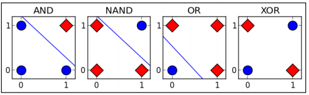
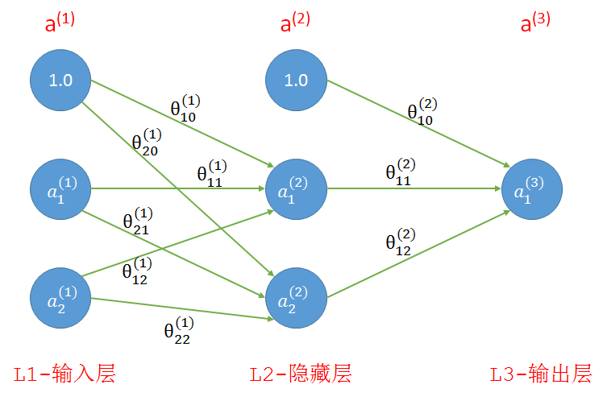
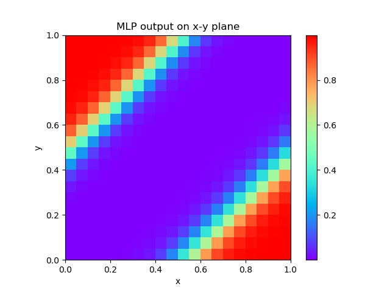
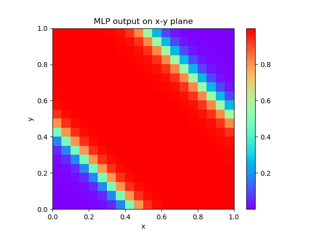

# XOR_Gate_NN

Solve the XOR problem by Neural Network.

### TwoLayerNet

The solution to solve XOR gate problem is using TwoLayerNet.

### Results

#### Output map

Select x from 0 to 1, and y from 0 to 1, and permutate them to generate inputs, we yeild output maps from this TwoLayerNet.

There are two possible output maps w.r.t. the proper TwoLayerNet.

### References

[1].【机器学习】神经网络实现异或（XOR）， [https://www.cnblogs.com/belter/p/6711160.html](https://www.cnblogs.com/belter/p/6711160.html)
